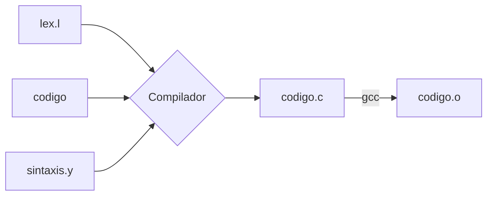

# Programación Para Pequeños
## Introducción
Cada día mas niños comienzan a estudiar programación desde mas jóvenes,y  a  esta  creciente  demanda  surgen  día  a  día  nuevas  herramientas  paraaprender a programar desde chicos, pero generalmente estas herramientasestán en inglés entonces quedan fuera del alcance de los niños que solamentehablan español. Decidimos colaborar con la causa y desarrollar un lenguaje,en español, lo mas simple y coloquial posible, que permita hacer las cosasbásicas de programación imperativa para dar los primeros pasos en la materia.

## Archivos destacados
- **makefile** : Archivo para generar los archivos ejecutables.
- **lex.l** : Definicion de la gramatica y palabras reservadas del lenguaje.
- **sintaxis.y** : Definicion de reglas y funciones auxiliares.

## Estructura

## Instalación
1. Clonar repositorio
	>git clone https://github.com/micabanfi/TP-TLA.git
2. Situarse en la carpeta
	> cd TP-TLA
4. Ejecutar makefile
	> make compiler
## Ejecución caso personalizado
4. Escribir un codigo
	>nano code.ppp
5. Compilarlo
	>./compiler <code.ppp> code.c
	gcc code.c -o code.o
6. Ejecutarlo
	> ./code.o

## Ejecución caso de prueba
4. Compilar caso de prueba elegido
	>./compiler <ejemplo1.m> test1.c
	gcc test1.c -o test1
5. Ejecutarlo
	>./test1

## Colaboradores
- Micaela Banfi - mbanfi@itba.edu.ar
- Juan Grethe - jgrethe@itba.edu.ar
- Martin Grabina mgrabina@itba.edu.ar
